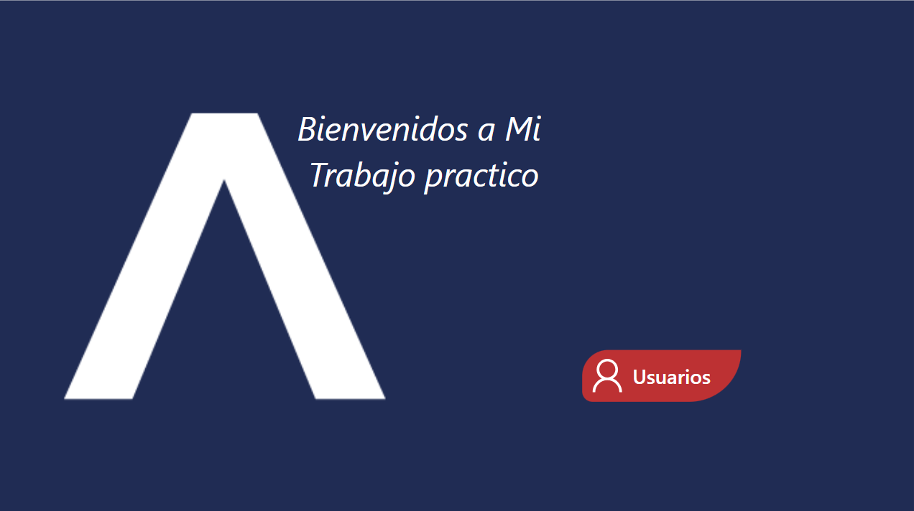
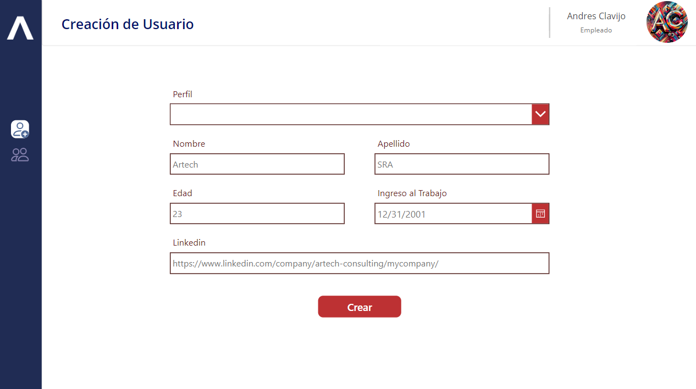
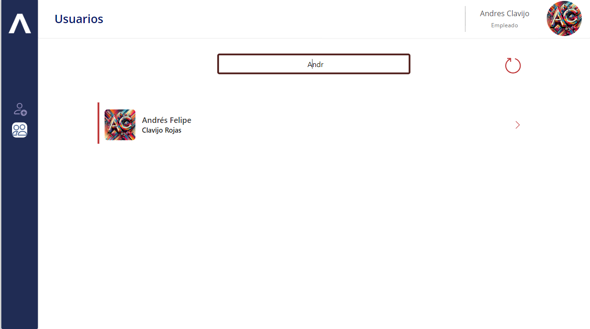
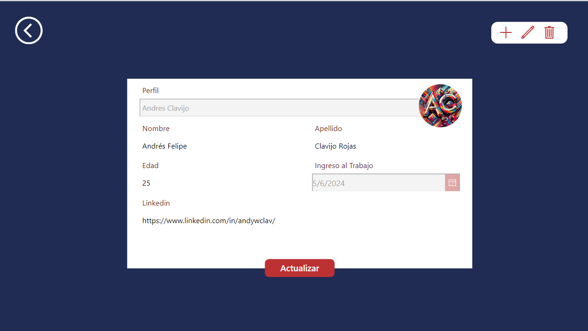

# PowerApps
## Descripción

Este proyecto es una aplicación CRUD (Crear, Leer, Actualizar y Eliminar) diseñada para gestionar información de manera eficiente y segura. La aplicación garantiza que solo los usuarios autorizados puedan realizar operaciones de creación, actualización y eliminación, mientras que los demás usuarios tienen acceso exclusivo a la funcionalidad de lectura. Este desarrollo fue parte de una capacitación interna de [Artech](https://www.artech-consulting.com.ar/)

## Funcionalidades

- **Crear:** Permite a los usuarios autorizados agregar nuevos registros a la base de datos.
- **Leer:** Todos los usuarios pueden visualizar los registros existentes.
- **Actualizar:** Los usuarios autorizados pueden modificar los registros existentes.
- **Eliminar:** Los usuarios autorizados pueden eliminar registros.

## Validaciones

La aplicación implementa validaciones para asegurar que solo los usuarios autorizados tengan acceso a las funciones de creación, actualización y eliminación, garantizando así la seguridad y la integridad de los datos.

## Tecnologías Utilizadas

- **PowerApps:** Plataforma utilizada para el desarrollo de la aplicación.
- **Power Automate:** Utilizado para automatizar flujos de trabajo y procesos.
- **SharePoint:** Base de datos empleada para almacenar la información.

## Diseño

La interfaz de usuario presenta un enfoque moderno, asegurando una experiencia intuitiva y agradable. Se han incorporado elementos de diseño responsivo para garantizar una visualización adecuada en diferentes dispositivos.

### Páginas

- **Home**
  

- **Crear Usuario**
  

- **Usuarios**
  

- **Edición de Usuario**
  