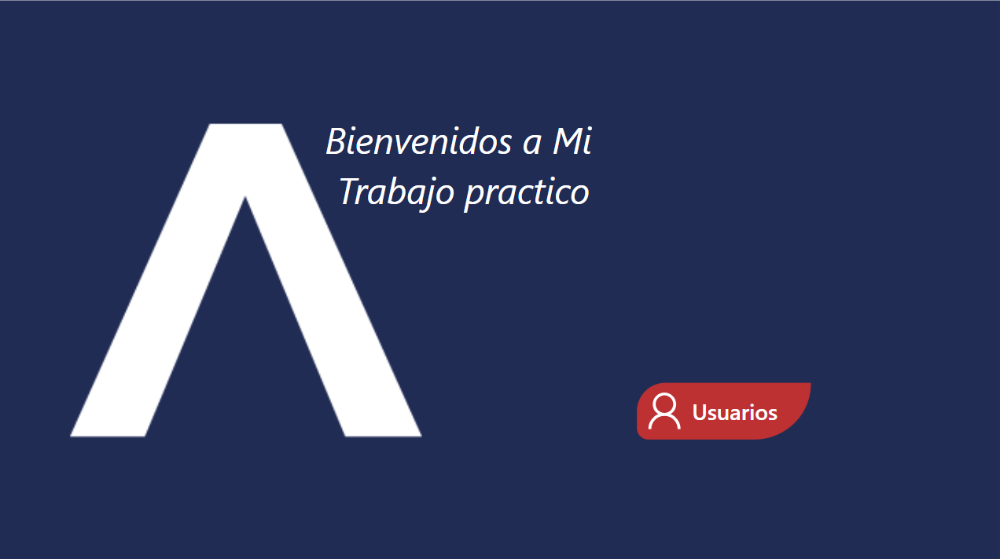
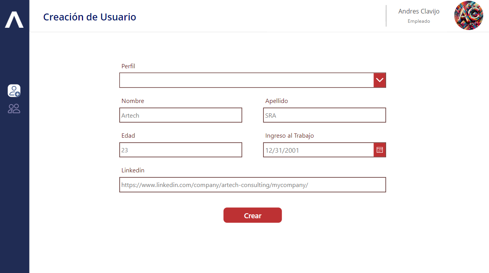
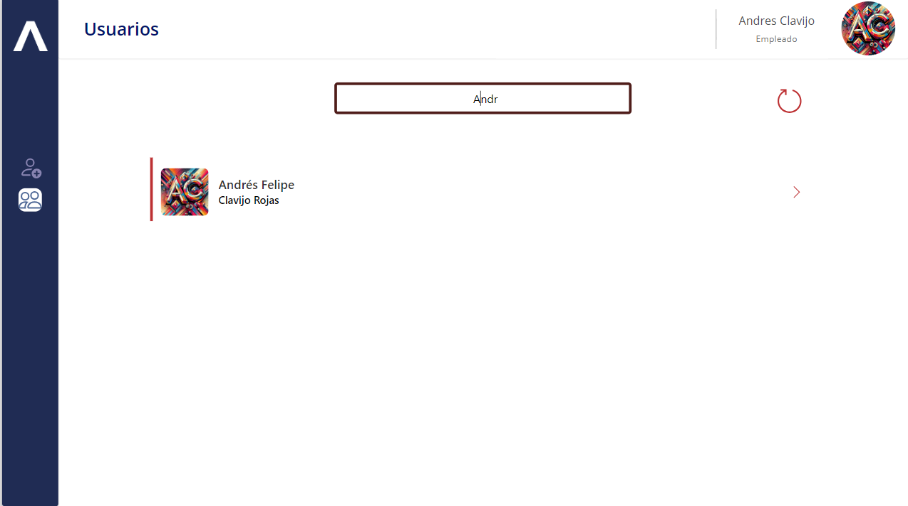
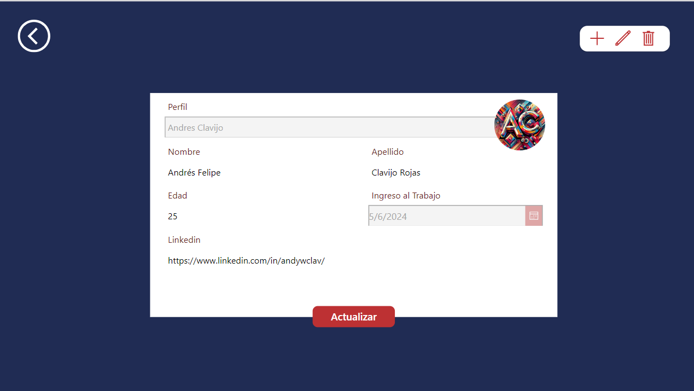

# PowerApps

## Description

This project is a CRUD (Create, Read, Update, Delete) application designed to manage information efficiently and securely. The app ensures that only authorized users can perform create, update, and delete operations, while other users have read-only access.

## Features

- **Create:** Allows authorized users to add new records to the database.
- **Read:** All users can view existing records.
- **Update:** Authorized users can modify existing records.
- **Delete:** Authorized users can delete records.

## Validations

The application includes validations to ensure that only authorized users have access to create, update, and delete functionalities, thereby maintaining data security and integrity.

## Technologies Used

- **PowerApps:** Platform used to develop the application.
- **Power Automate:** Used to automate workflows and processes.
- **SharePoint:** Database used to store the information.

## Design

The user interface follows a modern approach, ensuring an intuitive and user-friendly experience. Responsive design elements have been incorporated to ensure proper display across different devices.

### Pages

- **Home**  
  

- **Create User**  
  

- **Users**  
  

- **Edit User**  
  
